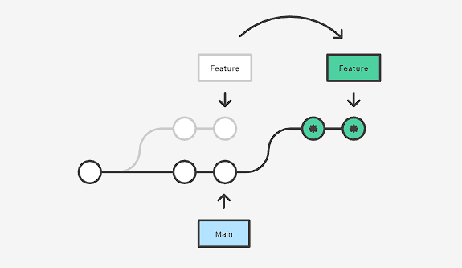

# Git and Github

A repo about git tutorial. It contains essential git commands with both local machine and remote server

## Local machine
- `git init .` -> initialize a local working directory
- `git add .` -> add to staging area
- `git commit -m "message"` -> commit to history (includes a bunch of commit)

## Remote server
An online platform to host and collaborate on git repos

- `git push` -> push changes to the `main` branch in remote server
- `git pull remote-name` -> pull new changes from remote server (ex. remote-name = origin)

## Show changes and status
- `git diff` -> show the current difference
- `git status` -> check working directory status
- `git log --oneline` -> see history(past commits)
- `git show history-id` -> show the changes from that commit

# Git Branches FLow

A branch represent an independent line of development

- `git branch -a` -> show a list of branches in the repo
- `git checkout -b branch-name` -> create new branch and move to that branch
- `git branch -d branch-name` -> delete that branch
- `git checkout branch-name` -> change to the that branch
- `git checkout -` -> change back to the previous branch

# Git Rebase

Rebasing is the process of moving or combining a sequence of commits to a new base commit. Rebasing is most useful and easily visualized in the context of a feature branching workflow.

## Steps
1. Put local changes aside
2. Merge current base and new changes from remote server together
3. Add local changes on the top.

## Commands
- `git pull -r origin main` -> pull and rebase
- `git push -f` -> force push
